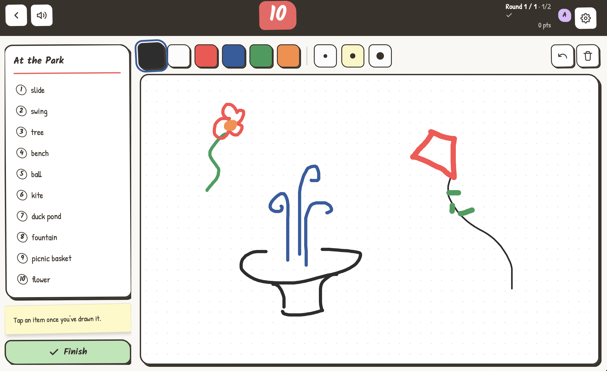
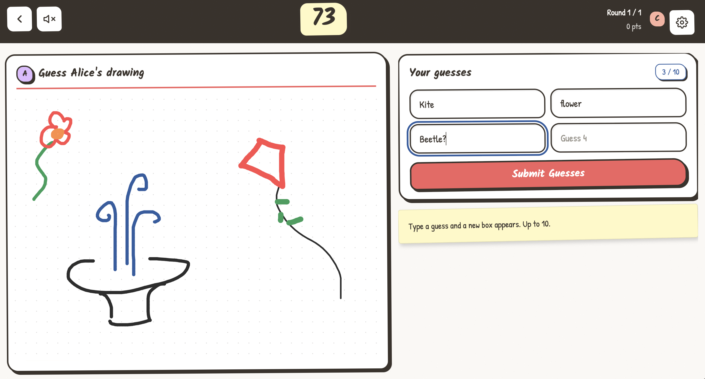

# 6 Second Scribbles

[](https://github.com/simonvanlierde/6-second-scribbles/actions/workflows/ci.yml)
[](https://codecov.io/gh/simonvanlierde/6-second-scribbles)
[](https://6ss.duinlab.nl)
[](LICENSE)

6 Second Scribbles is a real-time, multiplayer drawing-and-guessing game. One player races through a list of prompts while everyone else guesses what's being drawn, and rooms move through lobby, round, and results states over WebSockets.

A live demo is hosted at [6ss.duinlab.nl](https://6ss.duinlab.nl).

| The drawer's view | What the guessers see |
| --- | --- |
|  |  |

## Stack

- **Frontend** — Vue 3, TypeScript, Pinia, Vite, vue-i18n
- **Backend** — FastAPI, SQLAlchemy, PostgreSQL, Redis
- **Tooling** — pnpm, uv, just, Docker Compose, Vitest, Playwright, pytest

It's a monorepo: `frontend/`, `backend/`, and `contracts/` (committed OpenAPI and WebSocket schemas shared by both sides).

## Status

### Working

- Real-time multiplayer rooms over WebSockets
- Full game loop: lobby → drawing → guessing → results
- Guest and registered-user accounts
- Locale-aware prompt categories and guess matching
- Generated client/server contracts
- Unit, integration, and end-to-end tests
  
### Todo

- Full mobile support (currently desktop-first)
- Improved handling mid-game user disconnects

## Running locally

Requires Node 24+, Python 3.14+, `pnpm`, `uv`, `just`, and Docker.

```bash
just install                                   # install dependencies
cp backend/.env.example backend/.env.dev
cp frontend/.env.example frontend/.env.local
just dev                                        # Docker services + dev servers
```

`just up` runs the full containerized stack; `just test`, `just check`, and `just format` handle testing, linting, and formatting. See the [frontend](frontend/README.md), [backend](backend/README.md), and [contracts](contracts/README.md) docs for more.

## Attribution

Inspired by *Six Second Scribbles* by Hazel Reynolds, published by [Gamely Games](https://gamelygames.com/products/six-second-scribbles), and the solo web version by [Oliver Culley de Lange](https://github.com/OliverCulleyDeLange/6ss).

## License

Code is released under the [MIT License](LICENSE). The original *Six Second Scribbles* game concept, brand, and card content remain the property of their respective owners.
