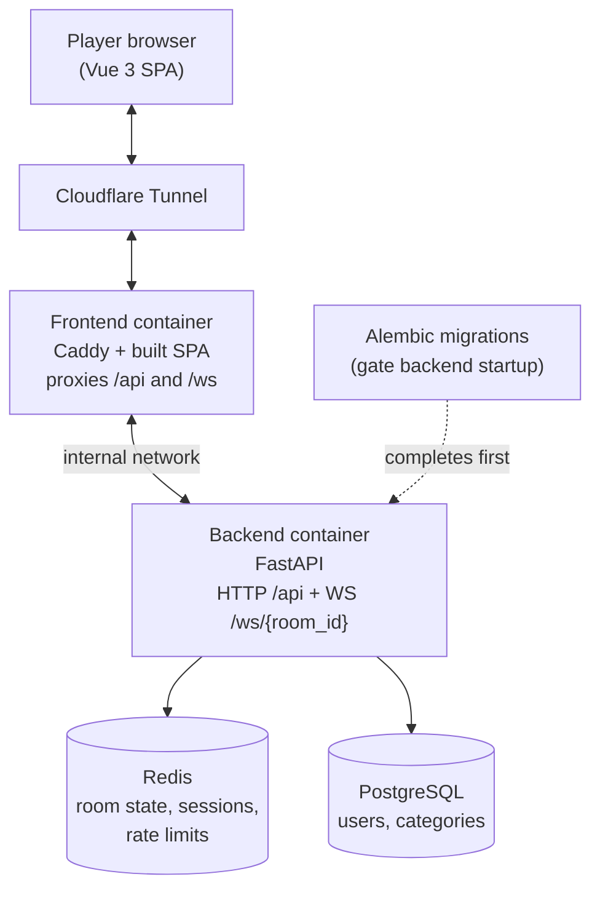
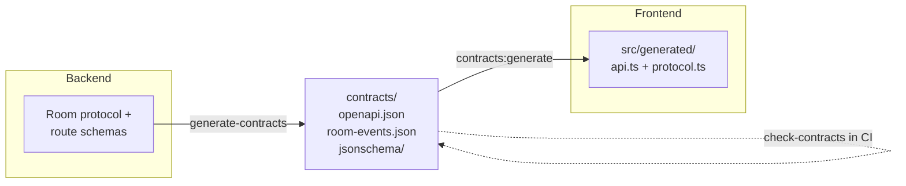
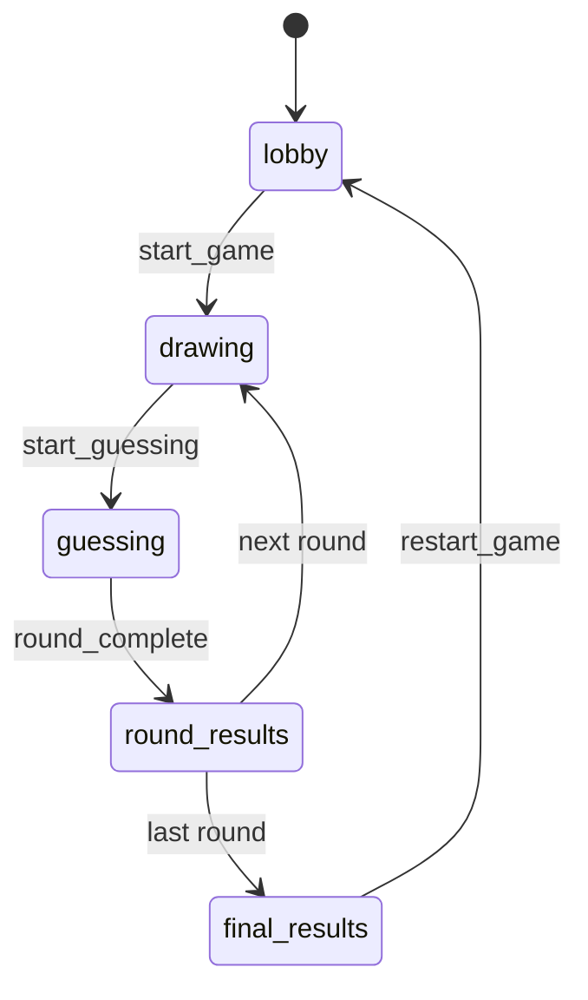

# Architecture

6 Second Scribbles is a monorepo with a Vue 3 single-page frontend, a FastAPI
backend, and a set of committed contracts that keep the two sides in sync. This
page gives a high-level map; the [frontend](../frontend/README.md) and
[backend](../backend/README.md) READMEs cover each side in more detail.

## Runtime Topology

In production the only external ingress is a Cloudflare tunnel. Caddy serves the
built SPA and reverse-proxies `/api` and `/ws` to the backend over the internal
Docker network, so the backend is never published directly. Redis holds
ephemeral room and session state; PostgreSQL holds durable content (users and
category data). Database migrations run to completion before the backend starts.

The [`compose.prod.yml`](../compose.prod.yml) overrides pin resource limits, bind
the frontend to loopback, and pin `cloudflared` by image digest. See its inline
comments for the reasoning behind each choice.

## Contract-First Boundary

The backend owns the wire format. Its route and schema definitions and the room
protocol are exported into `contracts/` as an OpenAPI document and JSON Schema
files. The frontend generates its TypeScript and Zod types from those committed
artifacts — it never guesses at the shape of a message. CI checks that the
committed contracts are reproducible from the backend, so a drift between the two
sides fails the build instead of reaching runtime.

The rationale and alternatives are recorded in
[ADR 0001](adr/0001-committed-generated-contracts.md).

## Game Loop

A room is a small state machine driven by the backend and pushed to every client
over WebSockets. Players move through the phases below; after the last round the
room lands on final results, and a restart returns it to the lobby.

The phase values are defined in
[`GamePhase`](../backend/app/core/types.py); the client and server message types
that drive the transitions live in
[`app/rooms/protocol.py`](../backend/app/rooms/protocol.py).
